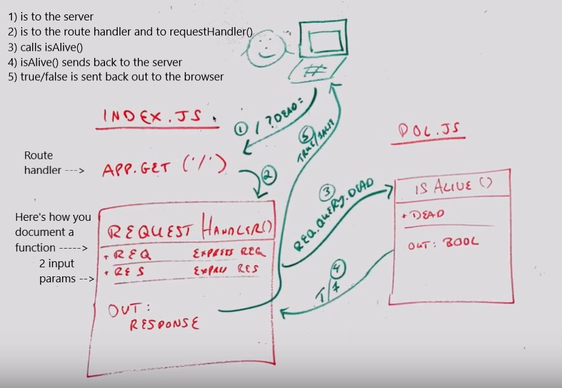

# LAB - 11 - Authentication

### Author: Gina Pultorak, Joanna Arroyo

### Links and Resources
* [submission PR](https://github.com/ginapult-401-advanced-javascript/lab-11-authentication/pull/5)
* [travis](https://travis-ci.com/ginapult-401-advanced-javascript/lab-11-authentication)

#### Documentation
* [jsdoc](https://ginapult-deploymentworkshop.herokuapp.com/docs/) (Server assignments)

### Modules
#### `pos.js`
##### Exported Values and Methods

###### `isAlive(dead) -> boolean`
Returns true/false to indicate how the server works

### Setup
#### `.env` requirements
* `PORT` - 3000

#### Running the app
* `npm start`
* Endpoint: `/`
  * Returns a boolean.
* Endpoint: `/docs`
  * Returns JSDoc Documentation Pages.
  
#### Tests
* Unit Tests: 'npm test'
* Lint Tests: 'npm run lint'

Incomplete Tests:
- Need to test xyz ...

#### UML

