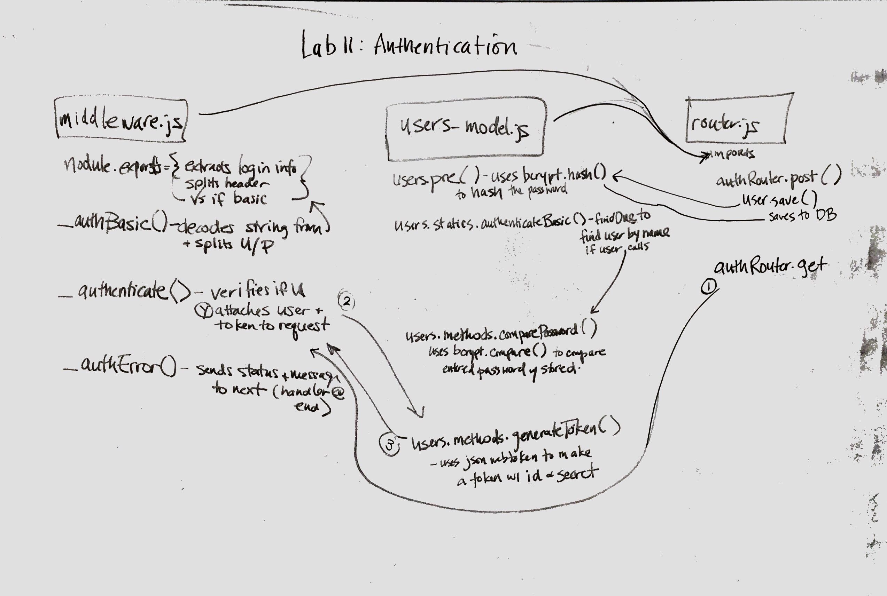

# LAB - 11 - Authentication

### Author: Gina Pultorak, Joanna Arroyo

### Links and Resources
* [submission PR](https://github.com/ginapult-401-advanced-javascript/lab-11-authentication/pull/8)
* [travis](https://travis-ci.com/ginapult-401-advanced-javascript/lab-11-authentication)

#### Documentation
* [jsdoc](https://lab-11-authentication-gpja.herokuapp.com/docs) (Server assignments)

### Main modules worked with
#### `middleware.js`
#### `router.js`
#### `users-model.js`
#### `books.js`

##### Exported Values and Methods

###### `_authBasic() -> object`
Returns split user name and password
###### `_authenticate() -> boolean`
Returns true/false to indicate verification of user
###### `_authError() -> string`
Returns error status and message
###### `users.pre() -> string`
Returns hashed password
###### `users.methods.authenticateBasic() -> boolean`
Returns true/false to indicate user authentication
###### `users.methods.comparePassword() -> boolean`
Returns true/false to indicate password match with stored
###### `authRouter.post()`
Saves user and user hashed password to database
###### `authRouter.get()`
Initiates authe process

### Setup
#### `.env` requirements
* `PORT` - 3000
* SECRET
* MONGODB_URI

#### Running the app
* `npm start`
* Endpoint: `/books`
  * Returns store books object.
* Endpoint: `/books/:id`
  * Returns single store book object.
* Endpoint: `/docs`
  * Returns JSDoc Documentation Pages.
  
#### Tests
* Unit Tests: 'npm test'
* Lint Tests: 'npm run lint'

Incomplete Tests:
- n/a

#### UML

